# Taller I (Linux)
*Carlos Felipe Aguirre Taborda 2022-02-25*

1. Dirigirse al `/home/[username]` del usuario creado y con los comandos anteriormente vistos en clase, crear la siguiente lista de carpetas.

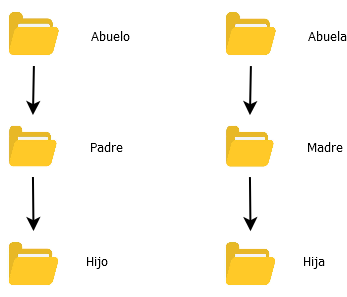

Para crear las carpetas primero debemos ubicarnos en la carpeta del usuario a donde se accede a traves del comando <b>cd</b> asi: `cd /home/[username]`.

Una vez ubicados en la carpeta del usuario creamos los directorios con el comando <b>mkdir</b> y su modificador <b>-p</b> que permite crear directorios hijos en caso de que no existan.

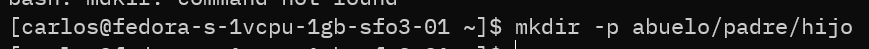
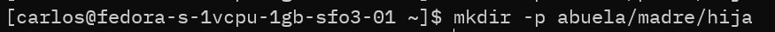

2. Ingresa a cada directorio y crea un archivo a través de CLI o consola, este archivo debe contener la siguiente informacion : *Nombres, Apellidos, Estatura, RH*

Una vez creamos la estructura de carpetas nos movemos hacia aquella donde deseamos crear el nuevo archivo ej:
`cd abuelo` entonces creamos un nuevo archivo de texto donde pondremos la información en un nuevo archivo, de la siguiente forma:
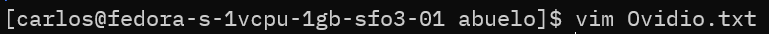 
en el momento que intremos al editor presionamos la letra **"i"** para cambiar a modo de insertar(la palabra *--INSERT--* aparecera en la parte inferior del editor).
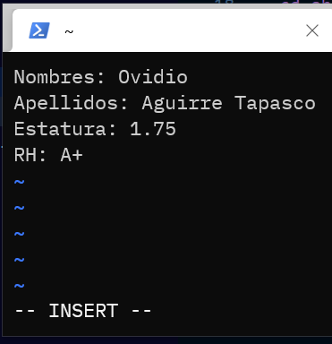 
Despues de ingresar la informacion presionaremos la **ESC** seguido de **:wq** para guardar el archivo, repetimos el procedimiento para los demas archivos:

### Padre
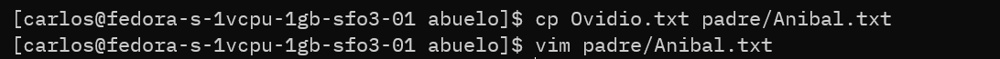 
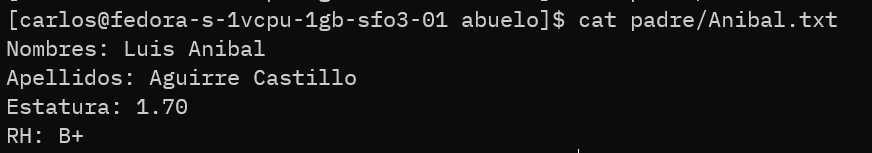 

### Hijo
 
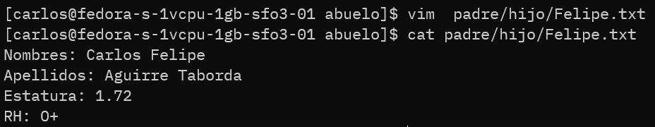 

### Abuela
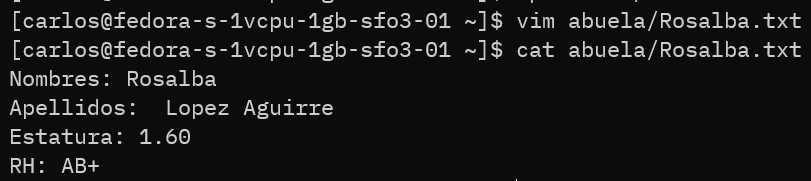 

### Madre

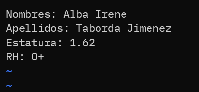 

### Hija

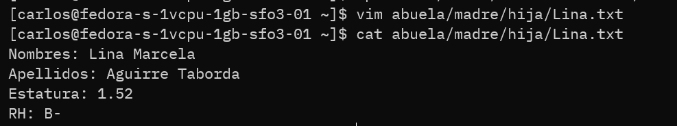 

3. Instalar el paquete tree y ejecutarlo en el directorio  del usuario.

Para instalar el paquete tree  haremos uso de nuestro gestor de paquetes *yum* usando el comando `yum install tree` el paquete tree muestra en consola la estructura de carpetas junto con los archivos que estos directorios contienen.

**Instalando del paquete tree**

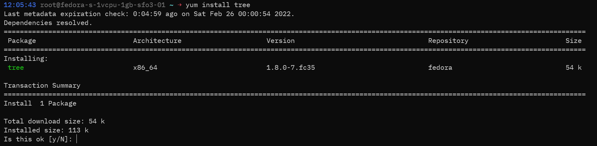 

presionamos la tecla **"y"** para confirmar la instalación.

Cuando se culmine la instalación solo queda usar el comando dentro de la carpeta del usuario para observar su funcionalidad:

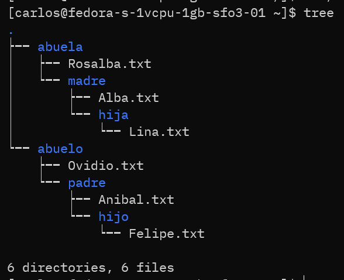 
Ahora podemos visualizar nuestra estructura de carpetas desde la terminal de una manera mas intuitiva.
Las carpetas estan representadas con el color azul y los archivos con color blanco.

