# Taller III (Linux)
*Carlos Felipe Aguirre Taborda 2022-03-11*

## 1. 
<b>a)</b> Comprimir el directorio `bisabuelo` y `bisabuela` (tar)  

Para comprimir las carpetas haremos uso del comanto `tar -cvf [nombrecomprimido] carpeta_a_comprimir` la badera <b>"c"</b>*(crear un nuevo archivo)*, <b>"f"</b> *(se usa para especificar que el comprimido se realizará desde un archivo/carpeta)* y <b>"v"</b>*(Mostrar el progreso del comando)*.

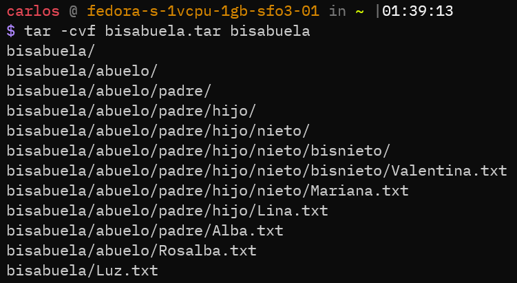
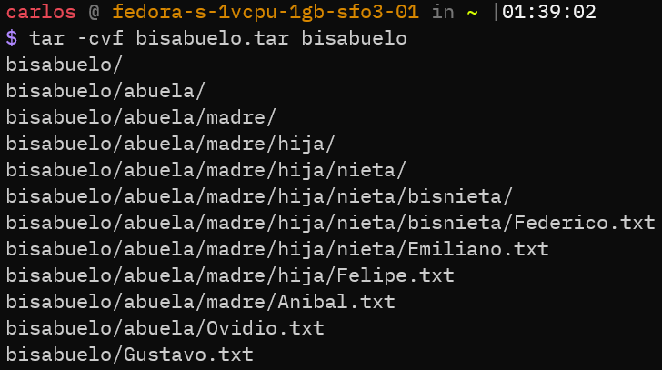

<b>b)</b> Comprimir el directorio `bisabuelo` y `bisabuela` (tar.gz, bz2)

Para comprimir en formato tar.gz se realiza de manera similar a la compresión con formato <b>.tar</b> de la siguiente manera: `tar -zcvf [nombrecomprimido] carpeta_a_comprimir` como se puede observar la unica diferencia es el uso de la bandera <b>"z"</b>*(indica que se use tambien el algoritmo de compresión gzip)*

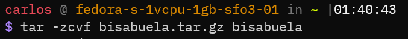

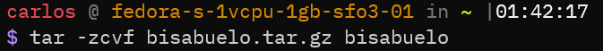

Para comprimir en formato <b>bz2</b> debemos instalar los paquetes `bzip2` como el manejador de paquetes <b>yum</b>.

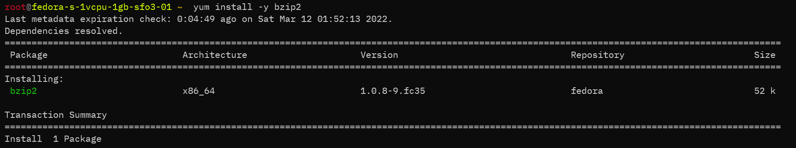

El algoritmo <b>bzip2</b> tiene la particularidad de que solo se puede emplear en archivos no en carpetas, por ende primero debemos crear un archivo <b>tar</b> y luego aplicar <b>bzip2</b> de la siguiente manera: `tar -cvf - [carpeta_a_comprimir] | bzip2 -9 -z - > [archivo_destino].tar.bz2` la bandera <b>"-9"</b>*(bloque de compresión de 900k)* y <b>"-z"</b>*(indica que se realizará una compresión)* .

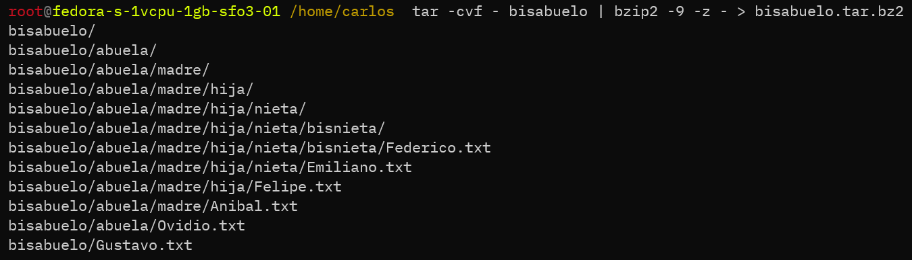

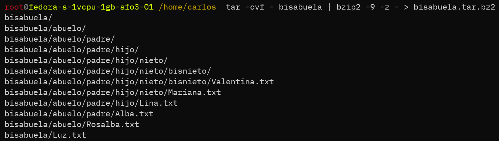

## 2. Listar los archivos comprimidos

El listado de archivos comprimidos es el siguiente:

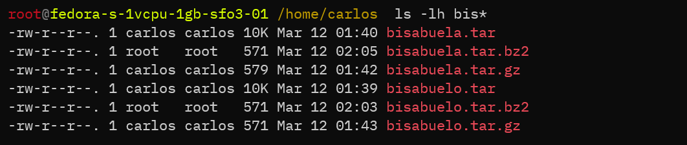

Para listar los archivos compridos en <b>tar</b> usamos el siguiente comando `tar -tvf [nombre_archivo].tar` la bandera <b>"t"</b>*(Permite ver el contenido de los archivos)*

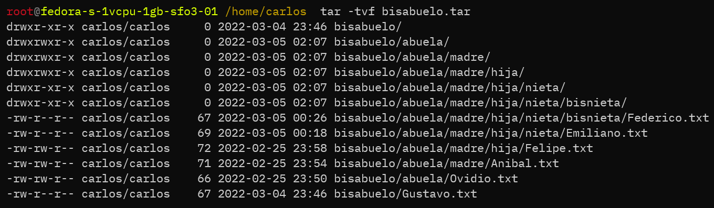

Para listar los archivos compridos en <b>tar.gz</b> usamos un procedimeinto parecido al anterior `tar -ztvf [nombre_archivo].tar.gz`.

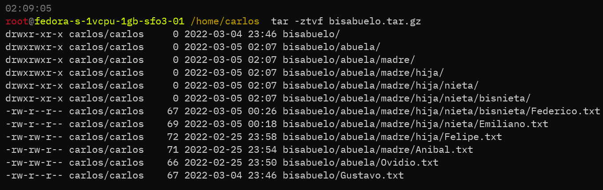

## 3. Descomprimir los directorios `bisabuelo` y `bisabuela` en las siguientes rutas: `tmp` y `root`.

Para descomprimir archivos en formato <b>tar</b> ó <b>tar.gz</b>  usamos el comando `tar -xvf [nombre_archivo].tar ó tar.gz -C [ruta_destino]` la bandera <b>-x</b> *(indica que se va a descomprimir)*, <b>-v</b> *(ver el progreso del procedimiento es opcional)* y <b>-f</b> *(para indicar la fuente)* además hacemos uso del parámetro <b>-C</b> para indicar la ruta de destino.

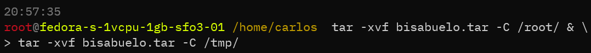

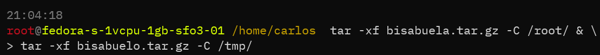

Aquí el resultado de la descompresón de los archivos en la carpeta `/tmp` y `/root`.

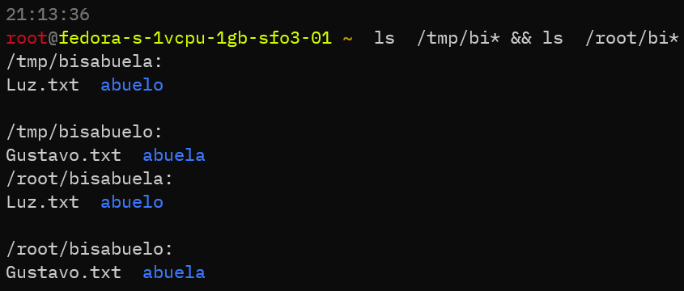

## 4. Comprimir los directorios usando la herramienta o paquete (zip, unzip) y descomprimir.

Para comprimir una carpeta usando <b>zip</b> haremos uso de la siguiente instrucción `zip -rq [archivo_destino].zip [nombre_carpeta]` la bandera <b>-r</b>*(significa recursivo para comprimir todos los archivos dentro de la carpeta)* y <b>-q</b>*(para omitir que muestre los archivos que se estan comprimiendo)*.

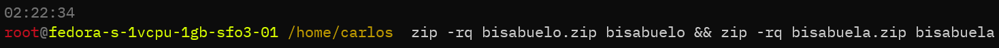

Para realizar la operación de descompresión de archivos utilizamos la siguiente instrucción:
`unzip [nombre_comprimido].zip -d [destino]` el comando <b>unzip</b>*(descomprime)* y con la bandera <b>-d</b>*(se especifica la ruta de destino)*
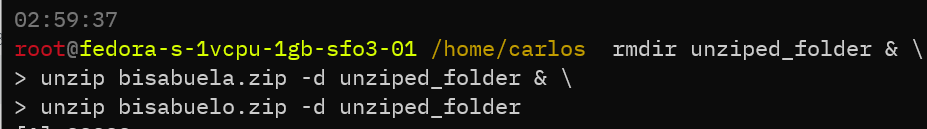

## 5. <b>Reto:</b> Realizar un script en bash shell que haga la copia de seguridad del directorio `/etc`. a las 24h todos los dias.

Con el siguiente script realizamos la copia de seguridad del directorio <b>etc</b> que guardaremos en la ruta `/home/carlos/backups` el nombre del archivo comprimido incluye la fecha de generación para evitar la sobrescritura del archivo de backups anteriores.

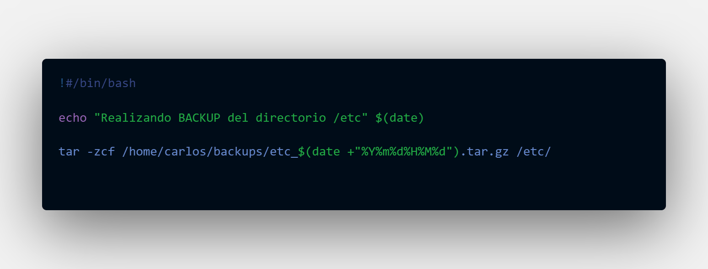

Ahora para hacer que el servidor ejecute el script a las 24:00 hrs añadimos un nuevo registro al crontab, el crontab nos permite indicar tareas que se ejecutarán de forma periódica en lapsos de tiempo determinados.

Accedemos al crontab así: 

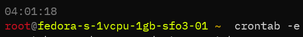

Ahora añadimos el registro de la tarea recurrente

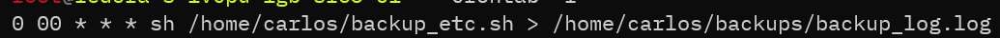

`0` indica el minuto 0  
`00` indica la hora 0/24  
`*` indica el día del mes, en este caso todos 
`*` indica el mes, en este caso todos 
`*` indica el día del mes, en este caso todos 

luego con el comando <b>sh</b> y la ruta del script para ejecutarlo.

Ahora listamos el contenido de la carpeta `backups` para observar el listado de archivos de respaldo:

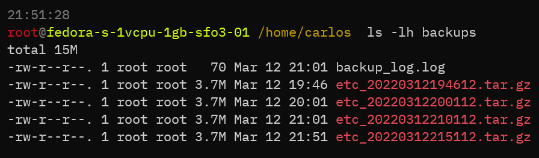

