# Taller IV (Linux)
*Carlos Felipe Aguirre Taborda 2022-03-18*

## 1) Crear dos grupos llamados profesor y estudiante

Para crear los grupos haremos uso del comando <b>groupadd</b> seguido de la opcion -r *(crear una cuenta del sistema)* de la siguiente manera:

 

ahora para verificar que los grupos se hayan creado exitosamente listamos las ultimas lineas del contenido del archivo `/etc/groups` con el comando <b>tail</b> en donde deben aparecer nuestros grupos

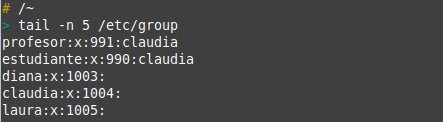 

## 2) Crear tres usuarios llamados: diana, claudia y laura

Para crear usuarios se usa el comando `useradd [nombre_usuario]` de la siguiente forma:

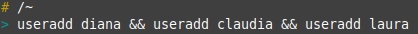 

Ahora verificamos que los usuarios se hayan creado mirando el contenido del archivo `/etc/passwd` en donde deben aparecer *(de forma similar a como lo hicmimos con los grupos)*

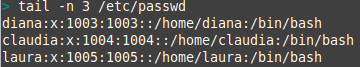 

## 3) Conociendo que: diana es un *profesor*; laura es una *estudiante* y claudia es un *profesor* y un *estudiante*. Adicione todos los usuarios a los grupos correspondientes.

Para añádir un usuario a un grupo utilizamos el comando <b>usermod</b> y algunas banderas, la bandera <b>-g</b> *(se usa en solitario si se desea cambiar el grupo del usuario)* y <b>-a</b> *(cuando se desea agregar un grupo al usuario)* ejemplo:

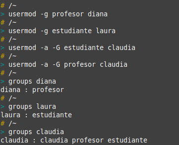 

A diana y laura se les cambio el grupo mientras que a claudia se le añadieron los grupos correspondientes.

Para verficar el procedimiento miramos los grupos a los que pertenece cada usuario con el comando `groups [nombre_usuario]`.

## 4) Cree dos directorios, uno para profesores (solo los profesores tienen acceso) y otro para estudiantes (profesores y estudiantes tienen acceso). Asegúrese de asignar los permisos.

Primero creamos los directorios con el comando `mkdir [nombre_carpeta]`

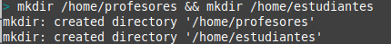 

Ahora asignamos tanto el grupo como los permisos, para el grupo usamos el comando `chown -R usuario:grupo [carpeta]` en este caso para profesores usaremos el usuario de <b>diana</b> y para estudiantes usamos a <b>laura</b>.

La carpeta de `profesores` solo será accesible para estos entonces usando <b>chmod</b> en usuario y grupo daremos permiso de lectura, escritura y ejecución, y en otro no daremos ningún permiso.

La carpeta de `estudiantes` permitirá aparte de el manejo por parte de estudantes el acceso de profesores, entonces para el usuario y el grupo daremos permisos de lectura, escritura y ejecución y para otros *(profesores)* daremos permisos de lectura y ejecución

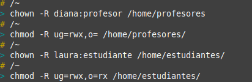 

## 5) Verifique los permisos anteriores, usando las cuentas de los usuarios ya creados

Como lo demuestra la siguiente captura <b>laura</b> tiene permisos sobre la carpeta de <b>estudiantes</b> pero <b>NO</b> sobre la de profesores.

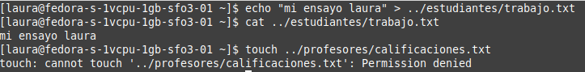 

Por el contrario <b>diana</b> tiene acceso total a la carpeta de profesores y además puede leer los archivos de la carpeta de de <b>estudiantes</b>

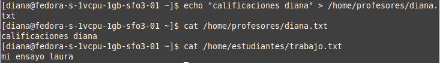 

## 6) Use un editor de texto para crear archivos en los respectivos directorios, usando diferentes usuarios.

Con <b>laura</b> podemos crear archivos en la carpeta de estudiantes pero no en profesores
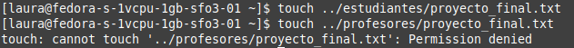 

Con <b>diana</b> podemos crear archivos en la carpeta de profesores pero no en estudiantes, aunque si podemos ver su contenido
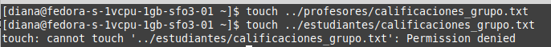 
Con <b>Claudia</b>  podemos crear archivos en ambas carpetas ya que pertenece a ambos grupos
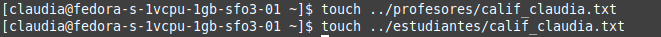 

## 7) Como super usuario, cambie de dueño los archivos creados

Para cambiar unicamente el propietario de un archivo usamos el comando 
`chown -R [nuevo_propietario]: /path/folder` de la siguiente manera

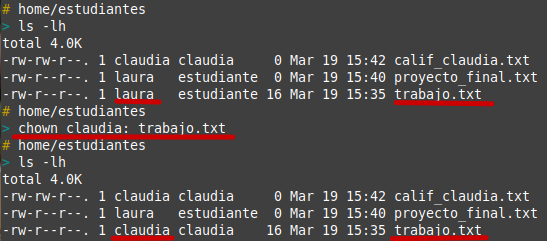

## 8) Usando diferentes terminales, entre al sistema con los diferentes usuarios:*(equivoquese algunas veces por completo)*:

## 9) Usando diferentes terminales, entre al sistema con los diferentes usuarios:*(equivoquese algunas veces en las claves o en el nombre de usuario)*: 

## 10) Determine la cantidad de veces que el estudiante laura ingreso al sistema.

Para determinar la cantidad de ingresos que se han realizado al sistema por parte de un usuario podemos hacerlo a traves de la combinación de tres comandos `last -F` *(Lista los ingresos de los usuarios al sistema)* , `grep [word]` que sirve para filtrar las lineas que contengan una palabra en un texto y por ultimo `wc -l` sirve para contar las lineas de un archivo

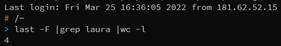

## 11) Comprima el contenidos del directorio de los profesores en profesore.tgz y el contenido del directorio de los estudiante en un archivo estudiantes.zip

Para comprimir archivos en tgz usamos
`tar -zcf [nombre_comprimido].tgz /carpeta/a/comprimir` y para comprimir en zip usamos `zip -rq [nombre_comprimido].zip /carpeta/a/comprimir`. Ahora listamos el contenido del directorio actual para ver los archivos comprimidos generados, que son los que aparecen de color rojo.

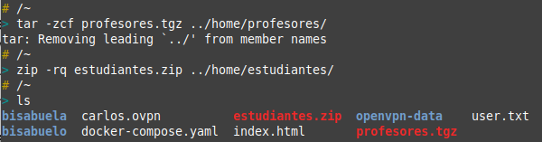

## 12) Cree un alias para cambiar la clave del usuario diana.

Creamos el alias de las siguiente manera `alias [nombre_alias]="comando"` para el caso actual:

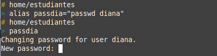

como podemos observar al ejecutar el comando <b>passdia</b> nos solicita una nueva contraseña para el usuario <b>diana</b> 