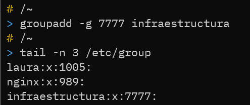
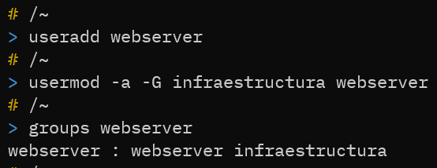
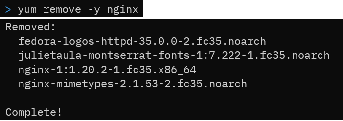
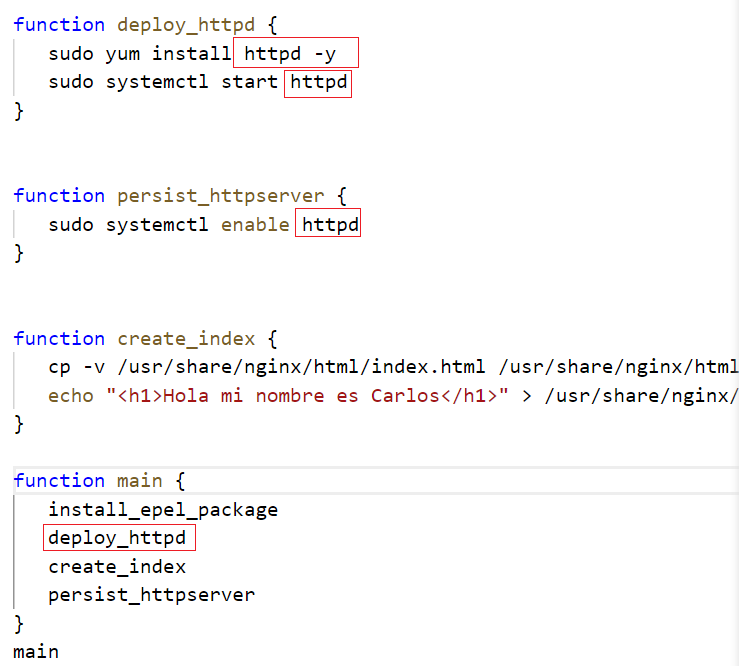
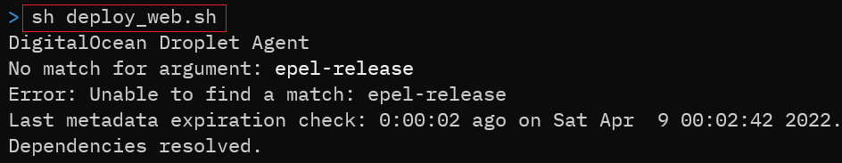
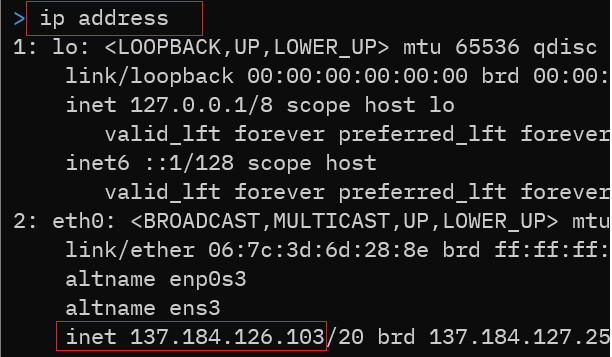

## Taller 6
Carlos Felipe Aguirre Taborda

## 1) Crear un grupo llamado  infraestructura con GID 777

Ejecutamos el comando `groupadd -g 7777 infraestructura`, luego con el comando <b>tail</b> sobre el archivo /etc/group verificamos que el grupo este creado.

## 2) Crear un usuario llamado webserver que pertenezca al grupo 

usamos el comando <b>useradd</b> para crear un nuevo usuario y luego usamos <b>usermod</b> para añadir el usuario <b>infraestructura</b> al grupo <b>webserver</b>.

## 3) Desinstalamos el servidor de nginx `yum remove nginx`

## 4) Usar el script del taller anterior y modificarlo para instalar el paquete httpd

Modificamos el script y cambiamos el paquete <b>nginx</b> por <b>httpd</b>

Ahora ejecutamos el script `sh deploy_web.sh`

Verificamos la dirección IP con el comando `ip address`

