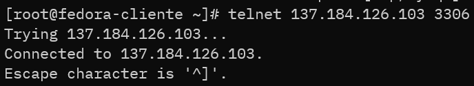

## Taller 7
<b>2022-04-13</b> Carlos Felipe Aguirre Taborda

## 1) Instalar mysql en la maquina servidor

Primero que todo vamos a instalar el servidor de base de datos en nuetra maquina servidor <b>mariadb</b>, para ello usaremos el comando
 `sudo dnf install mariadb-server -y`

luego de instalar el servidor nos aseguramos de iniciar el servicio de la base de datos 
con el comando `systemctl start mariadb` y luego usamos la opción <b>enable</b> para que el servicio sea persistente dentro del servidor
`systemctl enable mariadb`

Una vez realizado el paso anterior nos aseguramos de que el servicio este corriendo
con el comando `systemctl status mariadb`

## 2) Probar conexión al puerto 3306

La base de datos escucha conexiones a traves del puerto *3306* entonces intentamos conectarnos desde la maquina cliente a la maquina servidor por el puerto *3306* con el comando `telnet [ip_address] [port_number]`

Como se muestra en la imagen anterior no ha sido posible la conexión, esto se debe a que en la maquina servidor  deben realizarse dos configuraciones
 <ul>
 <li>Configurar maria-db para permitir conexiones remotas</li>
 <li>Abrir el puerto en el firewall</li>
 </ul>

## 3) Configurar el servidor para permitir conexiones remotas

Primero configuramos el servidor de bases de datos para permitir las conexiones remotas, para ello editamos el archivo de configuración y en el campo <b>bind-address</b> colocamos un valor de <b>0.0.0.0</b>

cuando realicemos este cambio reiniamos el servicio con `systemctl restart mariadb`.

Ahora nos queda abrir el puerto *3306* en el firewall con el comando `firewall-cmd --permanent --zone=public --add-port=3306/tcp`

## 4) Realizar de nuevo conexión al puerto *3306*

Con las conexiones remotas configuradas realizamos de nuevo la conexion al puerto 3306 igual a como lo hicimos en el paso #2 con el comando <b>telnet</b>

como podemos ver la salida del comando es distinta, indicando que pudo realizar la conexión de forma satisfactoria.

## Script con condicionales para instalar nginx y httpd

<a href="./deploy_web.sh" />Ruta script</a>

