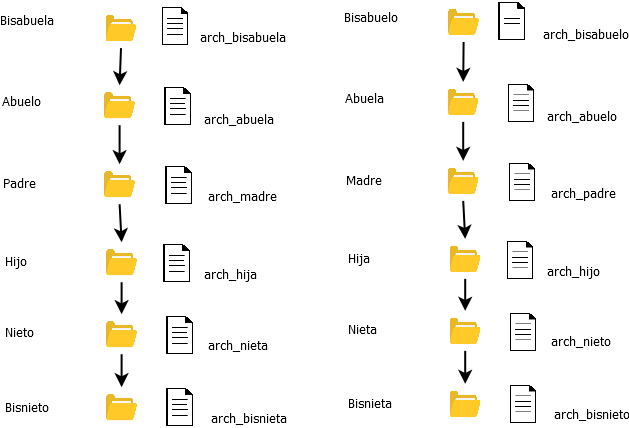
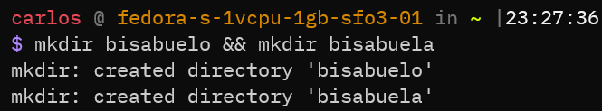
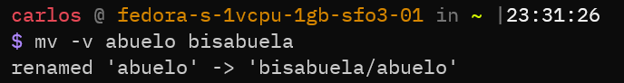
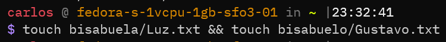
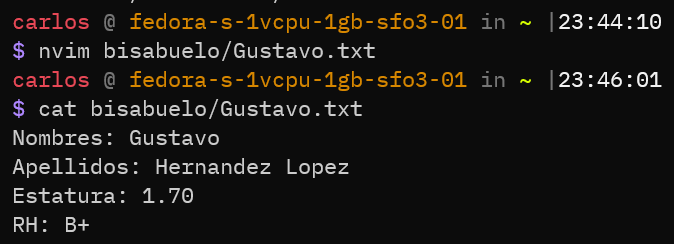
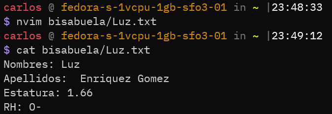
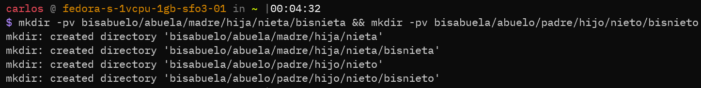

# Taller II (Linux)
*Carlos Felipe Aguirre Taborda 2022-04-03*

1) Transformar la estructura de carpetas del <b>Taller I</b> de como indica la imagen siguiente con el fin de practicar el movimiento, renombramiento de archivos y directorios de archivos y directorios 

* Lo primero que haremos será crear las carpetas `bisabuela` y `bisabuelo` con el comando <b>mkdir</b> 

* Una vez hecho esto movemos la carpeta `abuela` con todo su contenido dentro de la carpeta `bisabuelo`

* Ahora movemos la carpeta `abuelo` con todo su contenido dentro de la carpeta `bisabuela`

* Creamos los archivos  para diligenciar la información del bisabuelo y la bisabuela con el comando <b>touch</b> seguido del nombre del archivo como lo muestra la siguiente imagen:

Usando un editor de texto como <b>vi</b> diligenciamos la información del bisabuelo y la visabuela, quedarán así:

* Creamos las carpetas para contener la información para `nieto`,`bisnieto`,`nieta` y `bisnieta` con el comando <b>mkdir -p</b> la bandera <b>-p</b> sirve para crear las carpetas de forma recursiva.

