# Taller II (Linux)
*Carlos Felipe Aguirre Taborda 2022-04-03*

1) Recuperar contraseña de root de nuestra máquina virtual.

* En la primera pantalla que aparece despues de encender la <b>VM</b> presionamos la tecla <b>e</b>

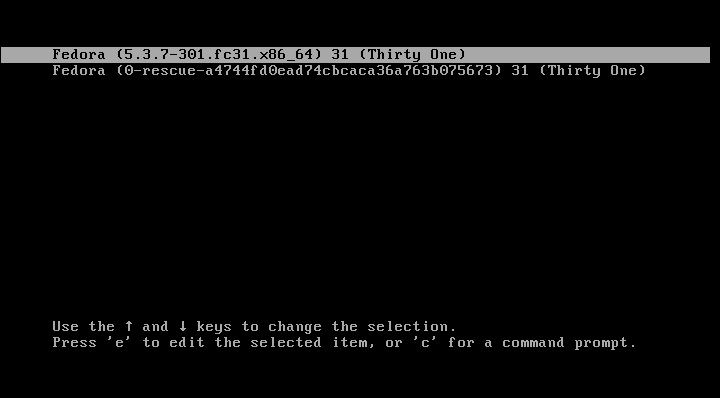

* Cambiamos la palabra `rhgb quiet` por `rd.break` 

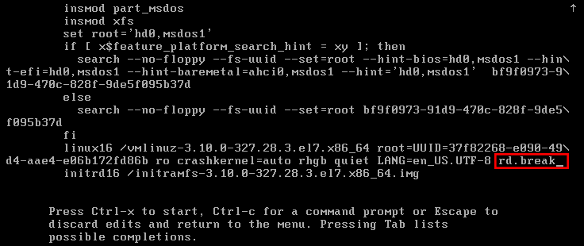

* Ahora presionamos la combinación de teclas `ctrl + x` 

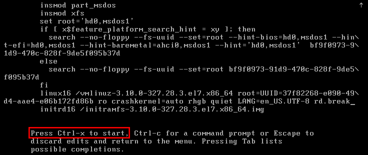

* Ahora montamos el sistema de archivos del usuario root en modo rw (lectura y escritura).

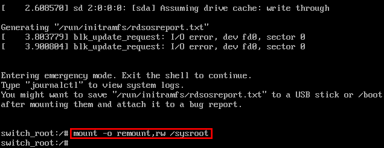

* Ahora con el comando <b>chroot</b> indicamos que haremos uso de la particion `sysroot` y que todos los comandos que usemos  harán referencia a esta

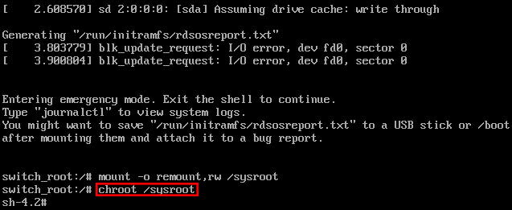

* Ejecumtamos el camdo <b>passwd</b> que nos solicitará una nueva contraseña para el usuario root, luego la escribimos de nuevo para confirmarla y presionamos la tecla <b>Enter</b>

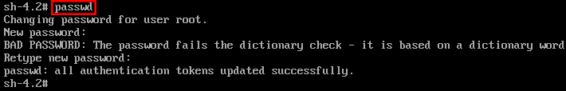

* Creamos un archivos con el comando <b>touch</b> llamado `.autorelabel` que le indicara al sistema que debe refrescar las etiquetas de los archivos

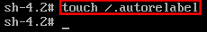 

* Ejecutamos el comando `exit` dos veces, el sistema se reiniciará de forma automática.

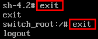

* Ahora podremos iniciar el sistema operativo con el usuario root y la contraseña que hemos cambiado anteriormente.

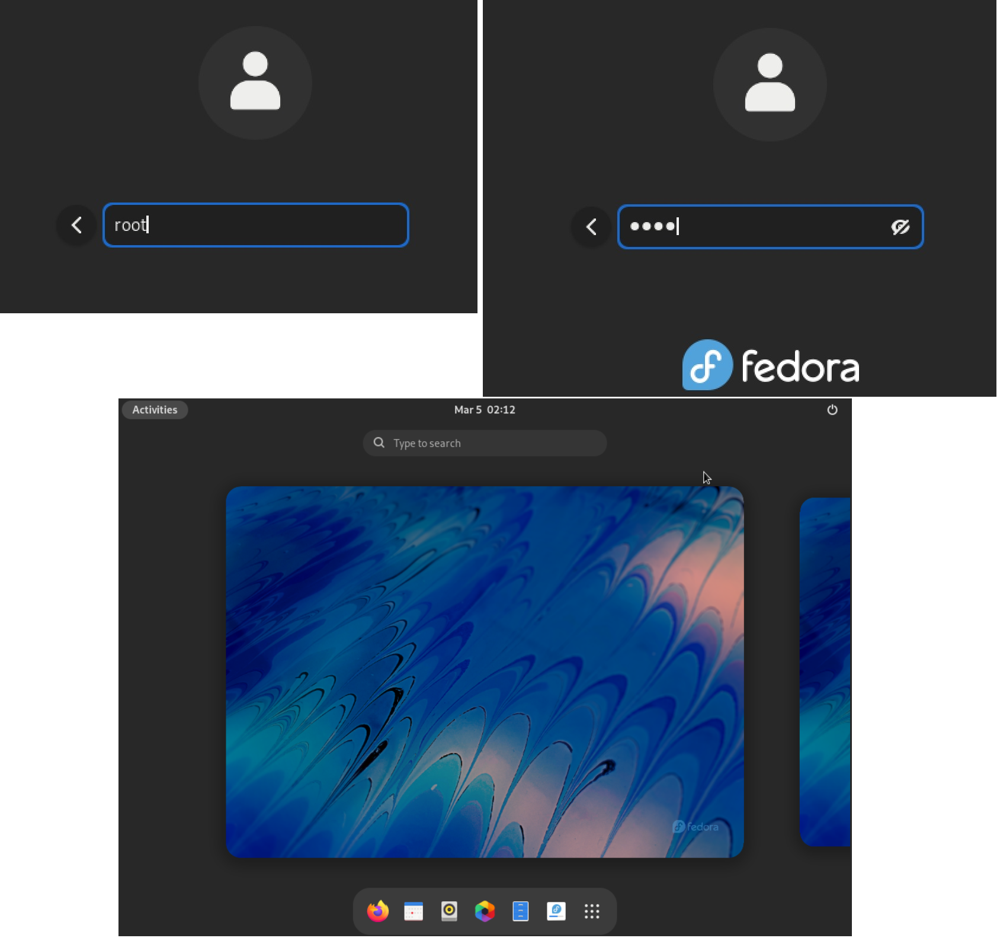

2) Transformar la estructura de carpetas del <b>Taller I</b> de como indica la imagen siguiente con el fin de practicar el movimiento, renombramiento de archivos y directorios de archivos y directorios 

* Lo primero que haremos será crear las carpetas `bisabuela` y `bisabuelo` con el comando <b>mkdir</b> 

* Una vez hecho esto movemos la carpeta `abuela` con todo su contenido dentro de la carpeta `bisabuelo`
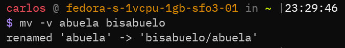

* Ahora movemos la carpeta `abuelo` con todo su contenido dentro de la carpeta `bisabuela`

* Creamos los archivos  para diligenciar la información del bisabuelo y la bisabuela con el comando <b>touch</b> seguido del nombre del archivo como lo muestra la siguiente imagen:

Usando un editor de texto como <b>vi</b> diligenciamos la información del bisabuelo y la visabuela, quedarán así:

* Creamos las carpetas para contener la información para `nieto`,`bisnieto`,`nieta` y `bisnieta` con el comando <b>mkdir -p</b> la bandera <b>-p</b> sirve para crear las carpetas de forma recursiva.

* Ahora creamos los archivos con la informacion para <b>nieto, nieta, bisnieta y bisnieto</b> con los comandos <b>vim</b>, entonces hacemos uso del comando <b>cat [nombre_archivo]</b> para verificar que el contenido se haya guardfado de forma correcta.

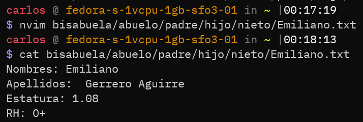
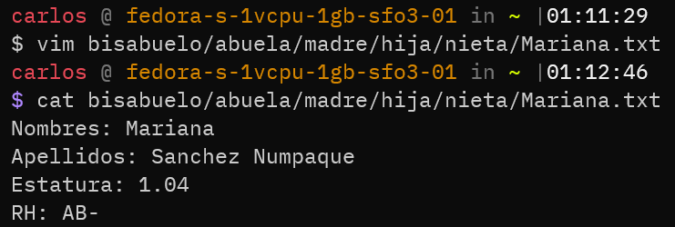
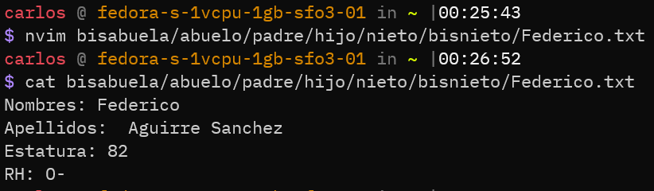
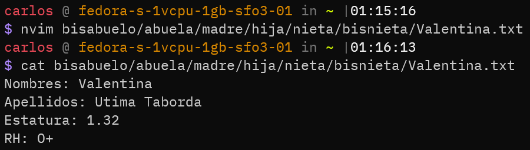

* Ahora intercambiamos los archivos que contienen la información de cada uno de los parientes con su genero contrario

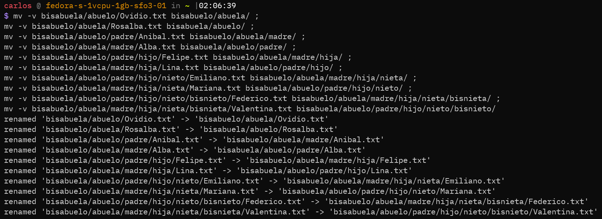 
El resultado despues de realizar todas las operaciones será el siguiente:

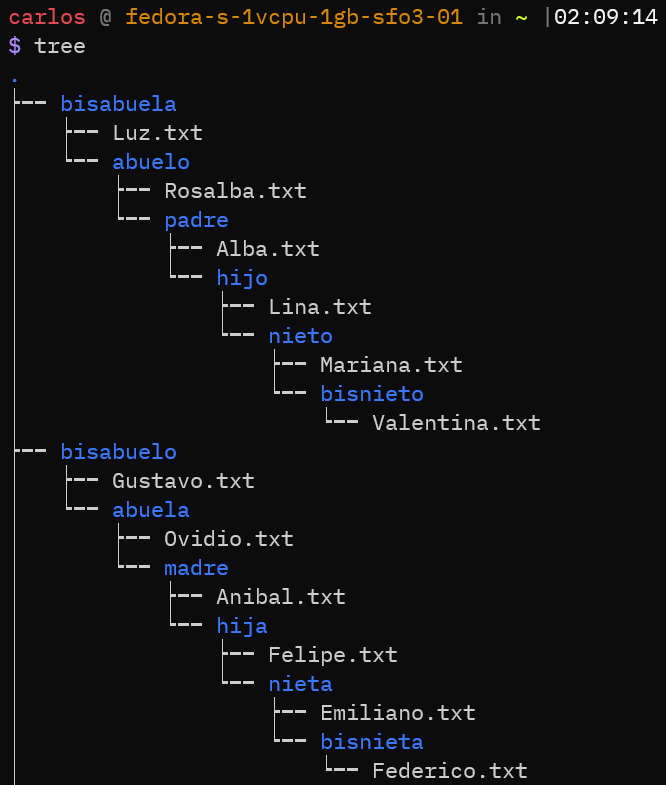 

